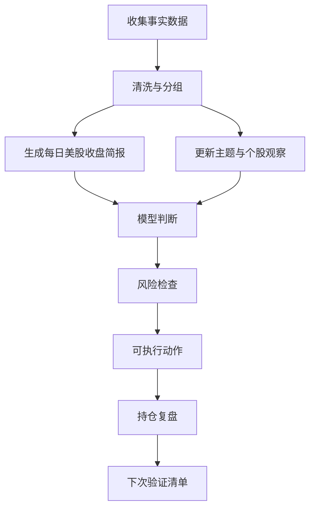

# 个人投资分析员工作流

> 本文参考 Anthropic `financial-services` / `financial-services-plugins` 中面向 `equity-research`、`financial-analysis`、`wealth-management` 的工作流思想，改写为当前 Codex 项目的个人投资分析 playbook。参考点包括：端到端研究流程、晨会/晨报、财报复盘、估值与情景分析、组合复盘、再平衡与税务/风险检查。本文不采用 Claude plugin 格式，只保留可复用的 Markdown 流程和 prompt。

## 使用边界

本 playbook 用于个人投资研究、复盘和交易前检查，不构成投资、法律、税务或会计建议。所有输出必须经过人工复核后再用于交易。

适用资产：

- 美股：指数 ETF、AI、半导体、AI 电力、贵金属、加密相关股票。
- 港股：互联网、半导体、能源、黄金、红利、指数 ETF。
- A 股基金/ETF：宽基、科创/创业板、半导体、人工智能、电力、红利、黄金、有色、债券/货币基金。

当前重点主题：

- AI 算力与半导体：NVDA、AMD、AVGO、TSM、MU、SMH、SOXX。
- AI 电力与数据中心基础设施：VRT、VST、CEG、ETN、GEV、LITE、COHR。
- 贵金属与大宗：GLD、SLV、CPER、USO。
- 加密与稳定币相关：CRCL、COIN、MSTR、矿企、加密 ETF。
- 高波动观察：OKLO、HIMS、PLTR、ORCL、小盘热门股。

## 核心原则

### 事实数据与模型判断分离

任何报告都必须分成两层：

1. 事实数据：价格、涨跌幅、成交量、估值、财报数字、指引、新闻事实、资金流、持仓、仓位、成本、回撤。
2. 模型判断：趋势解释、因果假设、情绪判断、估值观点、交易计划、风险偏好判断。

写作规则：

- 事实数据必须可追溯到数据源或原始材料。
- 模型判断必须明确写成判断，不伪装成事实。
- 没有确认的新闻、政策、财报、管理层讲话，不写成事实。
- 不能用“可能因为某新闻”替代可验证事实；无法确认时写“未确认驱动”。
- 所有投资建议必须包含：结论、依据、风险、可执行动作、信心分 1-10。

### 研究输出标准

默认输出结构：

```text
结论：
依据：
风险：
可执行动作：
信心分：
事实数据：
模型判断：
待验证事项：
```

信心分解释：

- 1-3：数据不足或分歧很大，只适合观察。
- 4-5：有方向性线索，但需要更多确认。
- 6-7：数据与逻辑较一致，可小仓位或按计划执行。
- 8-9：多源验证一致，风险可控，适合提高执行优先级。
- 10：极少使用，仅在事实高度确定且计划非常明确时给出。

## 日常工作流总览



每次分析先问四个问题：

1. 今天发生了什么事实变化？
2. 这些变化是否影响原投资假设？
3. 是否触发交易计划或风险阈值？
4. 如果什么都不做，下一次需要验证什么？

## 工作流 1：每日美股收盘简报

目的：每天北京时间早上，用收盘事实数据生成一份短、稳、可执行的美股复盘，服务当天港股/A 股基金/ETF观察与后续美股交易计划。

输入：

- 当前 `watchlist.json` 中的核心指数、宏观风险、商品、AI/半导体、AI 电力、重点个股。
- 收盘价、涨跌幅、成交量、区间位置、可选技术指标。
- 可验证的重大新闻、财报、宏观数据或政策事件。
- 前一日模型判断和未验证事项。

步骤：

1. 检查数据完整性：核心 ETF、VIX、10Y 美债、美元、SMH/SOXX、重点个股是否缺失。
2. 按分组总结强弱：大盘、风险偏好、利率/美元、半导体、AI 电力、贵金属/大宗、加密相关。
3. 识别异常：单日大涨大跌、板块背离、个股脱离板块、VIX 与指数方向不一致。
4. 区分事实与判断：先列事实，再给模型解释。
5. 生成下一交易日观察清单：最多 5 条，必须可验证。
6. 给出组合影响：对现有持仓是加分、扣分还是中性。

输出模板：

```text
# 每日美股收盘简报

日期：

## 事实数据
- 大盘：
- 风险：
- 利率/美元：
- AI/半导体：
- AI 电力：
- 贵金属/大宗：
- 加密相关：

## 模型判断
- 市场状态：
- 主线变化：
- 对当前持仓影响：

## 投资建议
结论：
依据：
风险：
可执行动作：
信心分：

## 下一交易日观察
1.
2.
3.
```

可复用 prompt：

```text
你是我的个人投资分析员，负责生成「每日美股收盘简报」中的模型判断、信息补充和投资建议。

你的任务：
基于用户提供的行情数据、watchlist 分组、已确认事件、可验证外部信息和你的市场分析能力，判断美股收盘后的市场状态，补充当天最重要的市场信息，并给出下一交易日观察重点和可执行投资建议。

硬性要求：
1. 必须严格区分「事实数据」和「模型判断」。
2. 可以补充可验证的外部信息，例如重大宏观数据、公司财报、监管变化、行业新闻、资金流或盘中重大事件。
3. 补充信息必须是有把握的事实；不确定的信息必须标注“待验证”或“不确定”，不能写成确定事实。
4. 不得编造新闻、政策、财报、官员讲话、管理层表态、盘中事件或市场传闻。
5. 如果没有可靠信息确认某个驱动原因，必须写“未确认具体驱动”，不能强行归因。
6. 投资建议必须包含：结论、依据、风险、可执行动作、信心分 1-10。
7. 重点关注但不限于：美股大盘、VIX、10Y 美债收益率、美元、AI/半导体、AI 电力、贵金属/大宗、加密相关股票，以及这些信号对港股和 A 股基金/ETF 的影响。
8. 输出中文，适合飞书手机端阅读，简洁、具体、克制。

分析框架：
请根据当天数据和事件，自主选择最重要的分析角度。可参考但不限于：
- 市场状态
- 主线变化
- 宏观环境
- 板块联动
- 异常信号
- 持仓影响
- 交易含义

输出要求：
必须返回 JSON。可以在 JSON 字段中补充必要解释，但不要脱离 JSON 格式。

输入：
[粘贴行情数据、新闻事实、持仓、前次观察事项]
```

## 工作流 2：持仓复盘

目的：像财富管理中的组合复盘一样，定期回答“持仓是否仍符合目标、风险是否过度集中、是否需要再平衡”。

频率：

- 每周一次：仓位、盈亏、回撤、主题暴露。
- 每月一次：投资假设、估值位置、风险预算、再平衡。
- 重大事件后：财报、暴跌、政策、行业拐点。

输入：

- 持仓列表：代码、市场、成本、现价、仓位、盈亏、持有理由。
- 现金比例、最大单票仓位、主题暴露比例。
- 近期简报结论、财报复盘、交易记录。

步骤：

1. 计算组合暴露：美股/港股/A 股基金/ETF、AI/半导体、电力、贵金属、加密、高波动小票、现金。
2. 检查集中度：单票、单主题、单市场、单货币、同一宏观因子。
3. 对每个持仓更新投资假设：买入理由是否仍成立，催化剂是否兑现，风险是否扩大。
4. 按“核心/卫星/观察/退出”分类。
5. 制定动作：加仓、减仓、止损、止盈、换仓、继续观察。
6. 记录下次触发条件。

输出模板：

```text
# 持仓复盘

日期：

## 组合事实数据
- 总资产：
- 现金比例：
- 最大持仓：
- 最大主题暴露：
- 本期收益/回撤：

## 持仓分层
- 核心：
- 卫星：
- 观察：
- 退出候选：

## 模型判断
- 组合当前风格：
- 最大收益来源：
- 最大风险来源：
- 是否需要再平衡：

## 投资建议
结论：
依据：
风险：
可执行动作：
信心分：

## 下次复盘触发条件
-
```

可复用 prompt：

```text
你是我的个人投资组合复盘助手。请基于我提供的持仓、成本、现价、仓位、交易记录和近期市场简报，做一次持仓复盘。

请严格分离：
- 事实数据：持仓、盈亏、仓位、价格、估值、已确认事件。
- 模型判断：投资假设变化、风险偏好、再平衡建议。

请特别检查：
1. AI/半导体/AI 电力是否过度集中。
2. 贵金属和现金是否足以对冲风险。
3. 加密相关和高波动小票是否超过风险预算。
4. 港股与 A 股基金/ETF 是否受到美股主线、美元、利率和人民币预期影响。
5. 是否存在“盈利但逻辑变弱”或“亏损但逻辑增强”的持仓。

每条建议必须包含：结论、依据、风险、可执行动作、信心分 1-10。

输入：
[粘贴持仓和近期市场数据]
```

## 工作流 3：个股 Earnings Review

目的：财报后快速判断个股是否超预期、预期如何变化、原投资假设是否需要调整。

适用：NVDA、AMD、AVGO、TSM、MU、VRT、VST、CEG、ETN、GEV、ORCL、PLTR、HIMS、CRCL 等。

输入：

- 财报新闻稿、10-Q/10-K、业绩电话会 transcript。
- 收入、毛利率、营业利润、EPS、自由现金流。
- 分业务/分地区/关键运营指标。
- 指引、订单、库存、资本开支、客户集中度。
- 财报前市场预期和盘后/次日价格反应。

步骤：

1. 先摘事实：本季实际值、同比/环比、市场预期、管理层指引。
2. 找三类差异：业绩差异、指引差异、叙事差异。
3. 更新关键假设：增长、利润率、资本开支、竞争格局、估值容忍度。
4. 判断市场反应是否合理：上涨/下跌是否由业绩、指引、估值或仓位拥挤驱动。
5. 给出持仓动作：持有、加仓、减仓、止盈、止损、等待电话会/更多数据。

输出模板：

```text
# Earnings Review

公司：
季度：

## 事实数据
- 收入：
- 利润/EPS：
- 毛利率/经营利润率：
- 现金流：
- 指引：
- 关键业务指标：
- 股价反应：

## 超预期/低预期
- 业绩：
- 指引：
- 管理层表述：

## 模型判断
- 投资假设是否变化：
- 估值是否仍可接受：
- 市场反应是否过度：

## 投资建议
结论：
依据：
风险：
可执行动作：
信心分：

## 待验证
-
```

可复用 prompt：

```text
你是我的个股财报复盘分析员。请基于我提供的财报数据、管理层电话会内容、市场预期和股价反应，完成 earnings review。

硬性要求：
1. 先列事实数据，再写模型判断。
2. 不要把管理层愿景当作已发生事实。
3. 明确区分：本季业绩、未来指引、市场预期、模型推断。
4. 重点判断原投资假设是否被强化、削弱或推翻。
5. 投资建议必须包含：结论、依据、风险、可执行动作、信心分 1-10。

额外关注：
- AI/半导体：数据中心收入、AI 加速器、HBM、先进封装、库存、毛利率、资本开支。
- AI 电力：数据中心订单、电网接入、核电/天然气/电力价格、设备交付周期。
- 加密相关：交易量、稳定币流通量、监管、利率收入、链上活跃度。
- 贵金属：实际利率、美元、央行购金、ETF 资金流。

输入：
[粘贴财报材料、市场预期、股价反应、当前持仓]
```

## 工作流 4：交易前风险检查

目的：在下单前把“想买/想卖”的冲动转化成可验证的交易计划。

触发条件：

- 新开仓。
- 单票加仓超过原仓位 25%。
- 高波动小票、加密相关、财报前后交易。
- 连续上涨后追高或连续下跌后补仓。
- 使用杠杆、期权或高波动 ETF。

检查清单：

```text
## 交易前风险检查

标的：
方向：买入 / 卖出 / 加仓 / 减仓 / 止损 / 止盈
计划仓位：
交易期限：日内 / 短线 / 波段 / 中长期

事实数据：
- 当前价格：
- 当日/近 5 日/近 20 日涨跌：
- 成交量：
- 估值或关键指标：
- 即将发生的事件：

模型判断：
- 买入/卖出的核心理由：
- 这笔交易赚的是什么钱：
- 哪个事实会证明我错了：

风险：
- 市场风险：
- 标的风险：
- 流动性风险：
- 财报/政策/宏观事件风险：
- 组合集中度风险：

可执行动作：
- 入场条件：
- 分批计划：
- 止损条件：
- 止盈/减仓条件：
- 复盘日期：

结论：
依据：
风险：
可执行动作：
信心分：
```

红灯规则：

- 无法说明“错了怎么办”，不交易。
- 无法区分事实和情绪，不交易。
- 交易后单票或单主题暴露超过风险预算，必须降级为小仓位或放弃。
- 财报前交易若没有明确仓位上限和亏损上限，不交易。
- 只因为“涨很多/跌很多”而没有基本面或交易结构依据，不交易。

可复用 prompt：

```text
你是我的交易前风控官。请审查这笔拟交易是否值得执行。

请不要直接迎合我的交易想法。你需要先找风险和反证，再给结论。

必须输出：
1. 事实数据
2. 模型判断
3. 结论
4. 依据
5. 风险
6. 可执行动作
7. 信心分 1-10

请特别检查：
- 是否追高或恐慌卖出。
- 是否和已有持仓高度相关。
- 是否临近财报、CPI、FOMC、非农、监管事件。
- 是否有足够流动性。
- 如果判断错误，最大损失是否可接受。

输入：
[粘贴拟交易标的、方向、仓位、理由、持仓、市场数据]
```

## 工作流 5：主题研究与候选池更新

目的：围绕 AI/半导体/电力/贵金属/加密等主题，持续维护可投资候选池。

步骤：

1. 定义主题驱动：需求、供给、政策、资本开支、利率、汇率、监管。
2. 拆产业链：上游、中游、下游、平台、工具、受益 ETF。
3. 分类标的：核心龙头、弹性标的、防守标的、高波动观察。
4. 设定关键指标：收入增速、毛利率、订单、库存、估值、资金流、政策变量。
5. 每周更新一次候选池：新增、移除、降级、升级。

主题输出模板：

```text
# 主题研究

主题：

## 事实数据
- 产业链变化：
- 价格/订单/库存：
- 政策/监管：
- 资金流：

## 标的分层
- 核心：
- 弹性：
- ETF/基金：
- 高风险观察：

## 模型判断
- 当前所处阶段：
- 主要催化剂：
- 最大反证：

## 投资建议
结论：
依据：
风险：
可执行动作：
信心分：
```

可复用 prompt：

```text
你是我的主题投资研究员。请围绕以下主题更新候选池，并说明哪些适合核心持仓、哪些只适合观察或小仓位交易。

主题范围可包括：AI 算力、半导体、HBM、先进封装、AI 电力、核电、数据中心设备、光通信、贵金属、加密金融、港股互联网、A 股 ETF。

要求：
1. 事实数据和模型判断分离。
2. 不要只讲故事，必须落到可跟踪指标。
3. 每个建议必须包含：结论、依据、风险、可执行动作、信心分 1-10。
4. 对美股、港股、A 股基金/ETF 分别说明适配方式。

输入：
[粘贴主题、候选标的、近期数据、持仓约束]
```

## 工作流 6：美股到港股/A 股基金联动

目的：把美股收盘信息转化为当天港股和 A 股基金/ETF 的观察重点，而不是机械追涨杀跌。

关注映射：

- QQQ/SMH/SOXX 强：关注港股科技、A 股半导体/人工智能 ETF，但要看人民币、北向/南向和本地政策。
- NVDA/AVGO/TSM/MU 强：关注半导体设备、存储、先进封装、AI 服务器、光模块。
- VRT/ETN/GEV/VST/CEG 强：关注电力设备、数据中心、核电、电网、储能。
- GLD/SLV 强：关注黄金 ETF、贵金属、有色基金。
- VIX 升、10Y 升、美元升：降低成长股追高意愿，提高现金/黄金/防守权重。
- 加密相关大涨：关注风险偏好扩散，但高波动标的只做小仓位和明确止损。

输出模板：

```text
# 美股收盘到港股/A股基金观察

## 事实数据
- 美股主线：
- 宏观条件：
- 风险偏好：

## 今日港股观察
-

## 今日 A 股基金/ETF 观察
-

## 模型判断
-

## 投资建议
结论：
依据：
风险：
可执行动作：
信心分：
```

## 数据质量与核验

优先级：

1. 公司公告、SEC/交易所文件、财报新闻稿、电话会 transcript。
2. 交易所、基金公司、ETF 官方页面。
3. 可靠行情源：yfinance、Polygon/Massive、券商行情、指数官网。
4. 新闻源：主流财经媒体、公司官网、监管机构。
5. 社交媒体只作为线索，不作为事实依据。

核验规则：

- 价格和涨跌幅至少来自一个行情源；关键交易决策尽量双源确认。
- 财报数据以公司公告为准，媒体摘要只作辅助。
- ETF/基金持仓以基金公司或交易所页面为准。
- 无法确认时写“待验证”，不进入结论依据。

## 输出质量检查

每份报告发送前检查：

- 是否有“事实数据”和“模型判断”两个部分。
- 是否所有建议都包含结论、依据、风险、可执行动作、信心分。
- 是否有编造或未验证的新闻归因。
- 是否写清楚“不做什么”。
- 是否有下一次复盘或验证触发条件。
- 是否适合手机端阅读。

## 建议的文件协作方式

- `watchlist.json`：维护观察池和主题分组。
- `docs/investment-analyst-playbook.md`：维护工作流和 prompt。
- `docs/runbook.md`：维护运行和部署方法。
- 每次新增主题或标的，优先更新 watchlist，再更新 playbook 中对应的主题映射。

## 参考来源

- Anthropic Financial Services Plugins GitHub 仓库：`https://github.com/anthropics/financial-services-plugins`
- 仓库 README 中的端到端工作流：Research to Report、Spreadsheet Analysis、Financial Modeling、Portfolio to Presentation。
- `equity-research` 描述：earnings updates、initiating coverage、investment theses、catalysts、morning notes、idea screening。
- `financial-analysis` 描述：comps、DCF、3-statement models、model audit、data connectors。
- `wealth-management` 描述：client reviews、financial plans、portfolio rebalancing、client reports、tax-loss harvesting。
